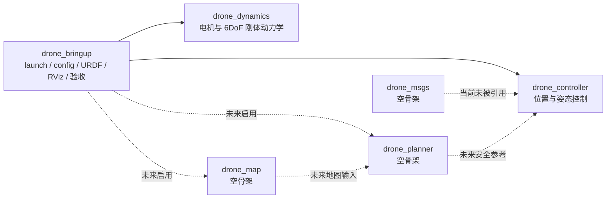
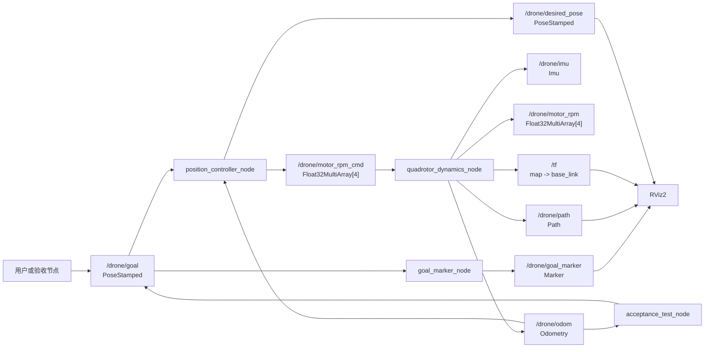
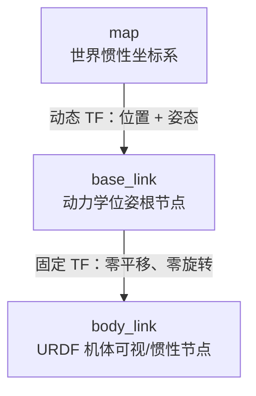
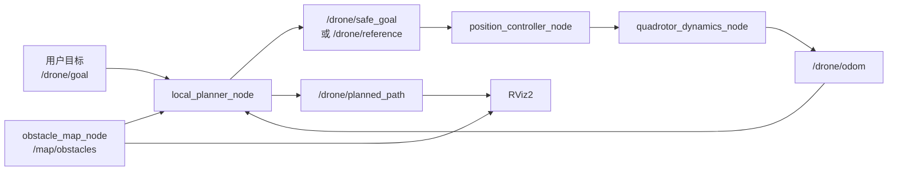

# ROS2 四旋翼仿真项目架构概览

## 1. 文档范围

本文描述当前仓库中实际存在的架构，并将尚未实现的地图和规划能力单独标为“目标架构”。接口、默认参数和公式均以 `src/` 下的源码及 `vertical_sim.yaml` 为准。

当前系统是一个进程级 ROS2 闭环仿真，不依赖 Gazebo：

```text
目标位姿
  -> 位置/姿态控制器
  -> 4 路电机 RPM 命令
  -> 6DoF 动力学
  -> Odom/IMU/TF/Path/实际 RPM
  -> 控制器反馈与 RViz 显示
```

## 2. 当前完成度边界

| 能力 | 当前状态 | 说明 |
|---|---|---|
| 6DoF 动力学 | 已有实现 | C++，固定步长墙钟定时器 |
| 四电机一阶响应 | 已有实现 | RPM 命令到实际 RPM |
| 位置与姿态控制 | 已有实现 | 位置 PD + 几何姿态反馈 |
| 电机 mixer | 已有实现 | 总推力/三轴力矩到 4 路 RPM |
| Odom、IMU、TF、Path | 已有实现 | 由动力学节点发布 |
| URDF、RViz、目标 Marker | 已有实现 | `drone_bringup` |
| 单目标自动验收 | 已有实现 | 当前环境基线尚未通过 |
| 自定义消息 | 未实现 | `drone_msgs` 为空包 |
| 静态地图 | 未实现 | `drone_map` 为空包 |
| 路径规划/避障 | 未实现 | `drone_planner` 为空包 |
| 地面站 | 未实现 | 当前采用 RViz |

## 3. 包级架构



### 3.1 `drone_dynamics`

职责：

- 订阅四路电机 RPM 命令；
- 模拟电机一阶动态；
- 计算各旋翼推力、总推力和三轴力矩；
- 积分位置、速度、姿态和机体系角速度；
- 施加线性阻力、角阻力、重力和简化地面约束；
- 发布 odometry、理想 IMU、轨迹、实际 RPM 和动态 TF。

非职责：

- 不做碰撞检测；
- 不模拟电池、电机电气模型、桨叶气动耦合或地效；
- 不添加传感器噪声、偏置和延迟；
- 不发布 `/clock`。

### 3.2 `drone_controller`

职责：

- 接收目标位姿和当前 odometry；
- 由位置误差和速度反馈计算期望加速度；
- 执行水平/竖直加速度限制；
- 由期望合力和目标偏航构造期望姿态；
- 使用 SO(3) 几何姿态误差和角速度反馈计算力矩；
- 通过 X 型 mixer 输出 4 路 RPM；
- 发布期望姿态供 RViz 显示。

当前控制器是 PD 控制器，没有积分项、轨迹前馈、抗积分饱和或电机失效分配。

### 3.3 `drone_bringup`

职责：

- 保存全局默认参数；
- 启动动力学、控制器、Robot State Publisher 和 RViz；
- 提供四旋翼 URDF 与 RViz 配置；
- 将目标位姿转换为持续显示的 Marker；
- 提供单目标自动验收节点和 launch。

### 3.4 预留包

- `drone_msgs`：没有 `.msg/.srv/.action` 定义。
- `drone_map`：没有节点或地图数据。
- `drone_planner`：没有节点或规划算法。

在实现前，文档和界面不得把这些包描述为已完成功能。

## 4. 运行时节点与进程

| 节点 | 包 | 语言 | 默认触发频率 | 主要职责 |
|---|---|---|---:|---|
| `quadrotor_dynamics_node` | `drone_dynamics` | C++ | 积分 200 Hz | 动力学和状态发布 |
| `position_controller_node` | `drone_controller` | C++ | 100 Hz | 位置/姿态控制和 mixer |
| `robot_state_publisher` | 外部 ROS2 包 | C++ | 事件驱动 | 发布 URDF 固定关节 |
| `goal_marker_node` | `drone_bringup` | Python | Marker 重发 5 Hz | RViz 目标球 |
| `rviz2` | 外部 ROS2 包 | C++ | 画面 30 FPS | 可视化 |
| `acceptance_test_node` | `drone_bringup` | Python | 10 Hz | 发目标并判定收敛 |

`acceptance_test_node` 只在 `acceptance_test.launch.py` 中启动；RViz 和目标 Marker 不在自动验收 launch 中启动。

## 5. 当前闭环数据流



## 6. ROS2 接口契约

所有当前自建 publisher/subscriber 都使用 depth 10 的默认 QoS，即 Reliable、Volatile、Keep Last。

| Topic | 消息类型 | Publisher | Subscriber | 语义/单位 | 预期频率 |
|---|---|---|---|---|---:|
| `/drone/goal` | `geometry_msgs/msg/PoseStamped` | 用户或验收节点 | 控制器、目标 Marker | `map` 系目标位置 m；四元数偏航 | 事件驱动 |
| `/drone/motor_rpm_cmd` | `std_msgs/msg/Float32MultiArray` | 控制器 | 动力学 | `[M1,M2,M3,M4]`，单位 RPM | 100 Hz |
| `/drone/motor_rpm` | `std_msgs/msg/Float32MultiArray` | 动力学 | 外部观察者 | 实际电机 RPM | 约 50 Hz |
| `/drone/odom` | `nav_msgs/msg/Odometry` | 动力学 | 控制器、验收节点 | 世界系位置/速度，机体系角速度 | 约 50 Hz |
| `/drone/imu` | `sensor_msgs/msg/Imu` | 动力学 | 外部观察者 | 理想姿态、角速度、机体系比力 | 约 50 Hz |
| `/drone/path` | `nav_msgs/msg/Path` | 动力学 | RViz | 最近最多 5000 个实际位姿 | 约 10 Hz |
| `/drone/desired_pose` | `geometry_msgs/msg/PoseStamped` | 控制器 | RViz | 目标位置和期望姿态 | 100 Hz |
| `/drone/goal_marker` | `visualization_msgs/msg/Marker` | 目标 Marker | RViz | 绿色球形目标 | 5 Hz 重发 |
| `/tf` | `tf2_msgs/msg/TFMessage` | 动力学等 | RViz/TF 消费者 | 动态 `map -> base_link` | 约 50 Hz |
| `/tf_static` | `tf2_msgs/msg/TFMessage` | Robot State Publisher | RViz/TF 消费者 | 固定 `base_link -> body_link` | Transient Local |
| `/robot_description` | `std_msgs/msg/String` | Robot State Publisher | RViz | URDF 描述 | Transient Local |

> “预期频率”来自源码定时器和分频逻辑，必须在阶段测试中实测确认。

## 7. 坐标系与模型树



- `map`：世界坐标系，重力方向为负 z。
- `base_link`：动力学节点发布的无人机位姿。
- `body_link`：URDF 中包含质量、惯量和全部可视几何。
- 四元数 `orientation_` 表示机体系到世界系的旋转。
- odometry 的线速度来自世界系积分结果；角速度为机体系角速度。

## 8. 电机布局与单位

电机顺序是跨动力学、控制器、测试和文档的硬接口：

```text
               机头 +X

        M1 前左          M2 前右
             \          /
              \        /
               机体中心
              /        \
             /          \
        M4 后左          M3 后右

                    +Y 指向左侧
```

当前力矩符号由源码定义：

```text
tau_x = l/sqrt(2) * (F1 - F2 - F3 + F4)
tau_y = l/sqrt(2) * (-F1 - F2 + F3 + F4)
tau_z = kM * (-w1^2 + w2^2 - w3^2 + w4^2)
```

外部接口使用 RPM；进入推力模型前转换为 rad/s：

```text
omega_i = rpm_i * 2*pi/60
F_i     = kF * omega_i^2
```

禁止将 RPM 直接代入 `kF * omega^2`。

## 9. 动力学模型摘要

### 9.1 电机一阶响应

源码使用离散一阶逼近：

```text
alpha        = clamp(dt / tau_motor, 0, 1)
rpm_actual  += alpha * (rpm_command - rpm_actual)
```

### 9.2 平动

```text
F_world = R_body_to_world * [0, 0, sum(F_i)]
F_g     = [0, 0, -m*g]
F_drag  = -D_v * v
a       = (F_world + F_g + F_drag) / m
v      <- v + a*dt
p      <- p + v*dt
```

位置更新使用已经更新后的速度，属于半隐式欧拉形式。

### 9.3 转动

```text
I * omega_dot = tau - omega x (I*omega) - D_w*omega
omega        <- omega + omega_dot*dt
q_dot         = 0.5 * q ⊗ [0, omega]
q            <- normalize(q + q_dot*dt)
```

### 9.4 数值保护

- RPM 被限制到 `[0, max_rpm]`；
- 四元数每步归一化；
- 位置、速度、加速度、角速度、角加速度或四元数出现非有限值时重置状态；
- `z < 0` 时位置和向下速度被钳制到地面。

## 10. 控制器模型摘要

### 10.1 位置环

```text
e_p   = p_target - p
a_des = Kp .* e_p - Kd .* v
```

- 水平加速度按二维范数限幅；
- 竖直加速度逐分量限幅；
- 加上重力补偿得到期望合力。

### 10.2 倾角限制与期望姿态

期望合力的水平分量限制为：

```text
||F_xy|| <= F_z * tan(max_tilt)
```

期望机体 z 轴沿期望合力方向，目标偏航用于构造期望机体 x/y 轴。

### 10.3 几何姿态控制

```text
e_R = vee(0.5 * (R_d^T R - R^T R_d))
tau = -K_R .* e_R - K_w .* omega + omega x (I*omega)
```

总推力为期望合力在当前机体 z 轴上的投影，并限制到：

```text
0 <= thrust <= 4*m*g
```

### 10.4 Mixer

控制器先求各电机角速度平方，再逐电机限制到最大 RPM 对应的范围，最后转换回 RPM。当前饱和方式是独立截断，因此极端情况下实际总推力/力矩不再严格等于期望值。

## 11. 默认参数摘要

| 分类 | 参数 | 默认值 |
|---|---|---:|
| 动力学 | 更新频率 | 200 Hz |
| 机体 | 质量 | 1.0 kg |
| 环境 | 重力 | 9.81 m/s² |
| 几何 | 机臂长度 | 0.22 m |
| 电机 | 推力系数 `kF` | `8.54858e-6` |
| 电机 | 反扭矩系数 `kM` | `1.37e-7` |
| 电机 | 时间常数 | 0.05 s |
| 电机 | 最大转速 | 10000 RPM |
| 惯量 | `Ixx, Iyy, Izz` | `0.005, 0.005, 0.009 kg*m²` |
| 位置环 | `Kp` | `[1.8, 1.8, 3.0]` |
| 位置环 | `Kd` | `[2.2, 2.2, 2.5]` |
| 姿态环 | `Kr` | `[0.08, 0.08, 0.05]` |
| 角速度环 | `Kw` | `[0.018, 0.018, 0.012]` |
| 安全限制 | 最大水平加速度 | 3.0 m/s² |
| 安全限制 | 最大竖直加速度 | 3.0 m/s² |
| 安全限制 | 最大倾角 | 25 deg |
| 安全限制 | 单次目标距离 | 10 m |

控制器与动力学重复声明了质量、重力、机臂、推力系数、反扭矩系数、惯量和最大 RPM。它们必须保持一致。

## 12. 启动模式

### 12.1 完整可视化

```bash
ros2 launch drone_bringup sim.launch.py
```

启动动力学、控制器、Robot State Publisher、目标 Marker 和 RViz。

### 12.2 无 RViz

```bash
ros2 launch drone_bringup sim.launch.py rviz:=false
```

RViz 不启动，其他节点仍启动。

### 12.3 核心闭环

```bash
ros2 launch drone_bringup core_sim.launch.py
```

只启动动力学和控制器。

`vertical_hover.launch.py` 当前也只启动相同两个节点，功能上与 `core_sim.launch.py` 重叠，后续应决定保留、重命名或删除。

### 12.4 自动验收

```bash
ros2 launch drone_bringup acceptance_test.launch.py
```

启动动力学、控制器和验收节点。默认判据：

- 三维位置误差不大于 `0.05 m`；
- 偏航误差不大于 `3 deg`；
- 线速度不大于 `0.05 m/s`；
- 角速度不大于 `0.05 rad/s`；
- 连续稳定至少 `1 s`；
- 总超时 `15 s`。

其中 launch 当前只暴露位置、偏航和超时阈值；速度阈值和稳定时间只能使用节点默认值。

## 13. 当前已知架构风险

1. 当前环境中的系统闭环验收没有复现历史 PASS，需先检查 DDS/RMW、topic 连接和定时器。
2. 自动验收子进程失败时，外层 launch 命令可能仍返回 0，CI 可能误判。
3. 动力学和控制器缺少行为级单元测试。
4. C++ 动力学包没有显式声明 C++17，但使用了 `std::clamp`。
5. 多个包仍包含 `TODO` 元数据和 `0.0.0` 版本。
6. 共享物理参数在两个节点中重复，配置漂移会破坏闭环。
7. `Float32MultiArray` 不携带电机顺序、单位和时间戳，接口自描述性较弱。
8. IMU 没有协方差、噪声和偏置，不能等同于真实传感器。
9. 轨迹最多 5000 点但不可配置，约 10 Hz 时保存约 500 秒。
10. 独立电机饱和会改变 mixer 输出的力/力矩比例。
11. `core_sim.launch.py` 与 `vertical_hover.launch.py` 重复。
12. 地图、规划和自定义消息只是骨架，不应进入“已完成功能”清单。

## 14. 目标扩展架构

仅在必做闭环和测试稳定后扩展：



扩展时必须把“用户最终目标”和“控制器当前安全参考”分成不同 topic，避免规划器输出重新进入自身输入形成回环。

## 15. 架构变更准则

- 修改 topic、frame、电机顺序、单位、QoS 或共享物理参数属于接口变更，必须同步更新测试和文档。
- 修改动力学符号、积分顺序、mixer 或姿态误差定义属于数学行为变更，必须增加针对性单元测试和场景回归。
- 地图与规划功能必须可关闭；关闭后不得改变必做闭环。
- 所有结果声明以当前提交和当前参数的可复现测试为准。
